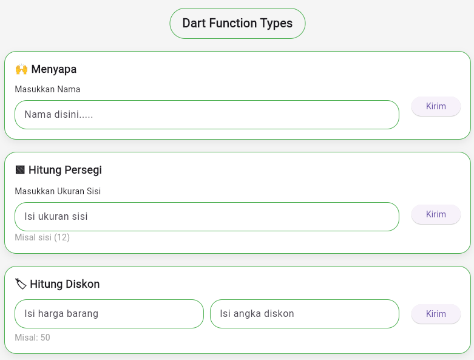

# 🚀 Dart Function Flutter App

## 📌 Deskripsi
Project ini merupakan aplikasi Flutter sederhana yang mengimplementasikan konsep **Function dalam Dart**.

Terdapat 3 fitur utama:
- Menyapa (Greeting)
- Kalkulator Luas Persegi
- Kalkulator Diskon

Setiap fitur menggunakan **4 tipe function**, yaitu:
1. Tanpa parameter & tanpa return
2. Tanpa parameter & dengan return
3. Dengan parameter & tanpa return
4. Dengan parameter & dengan return

---

## 🧠 Teknologi
- Flutter
- Dart

---

## 📱 Fitur
- Input nama untuk menyapa user
- Menghitung luas persegi
- Menghitung diskon harga
- Hasil ditampilkan langsung di masing-masing bagian

---

## ▶️ Cara Menjalankan
```bash
flutter pub get
flutter run

---

## 📸 Tampilan Aplikasi

<p align="center">
  
</p>
